# About Tiny Editor

Use the Tiny Editor package to build lightweight HTML5 games running on the new Tiny Unity game engine. For example, use Tiny Editor to create playable ads or games for messenging platforms. The Tiny Editor package also includes optional samples to get you started quickly.

# Installing Tiny Editor

Including the package in your project is enough to start building a game. However, the package comes with extra resources:
- Tiny Samples: To install, open *Tiny / Import Samples...*. Samples are installed in the `Assets/UTinySamples` folder.

> **Tip!** When upgrading the Tiny Editor package, make sure to also update the samples if you've installed them previously.

# Using Tiny Editor

## Tiny Layout
In Tiny Unity, you must use a set of windows not shown by default. To bring all these windows in your current layout, simply select the *Tiny / Layouts / Tiny Mode* option from the application menu.

Once *Tiny Mode* is applied, your Unity layout should look like this:

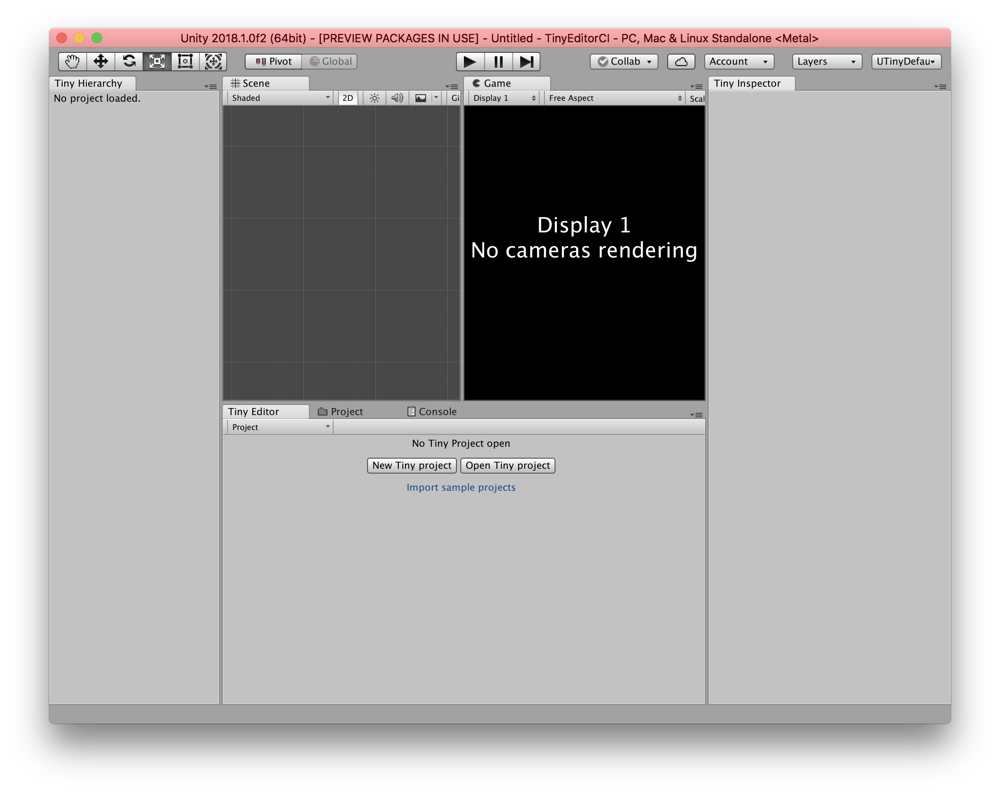

## Tiny Editor Window
This window is the main Tiny Unity window, where you can create and edit Tiny projects.

When no project is open, this window looks like this:
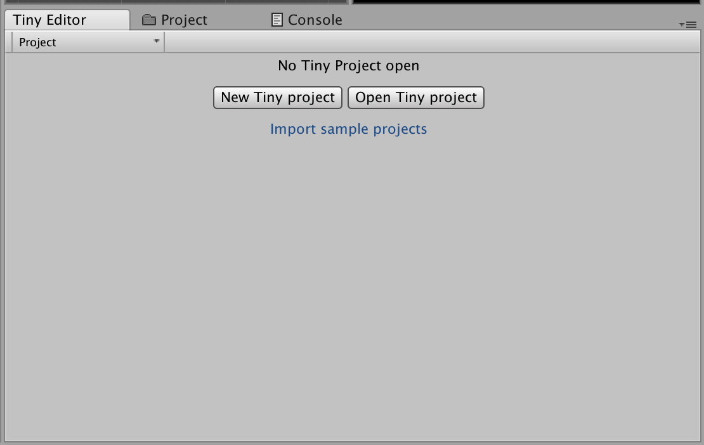

In this state, you can:
* Create a new Tiny project by clicking on *New Tiny Project*
* Open an existing Tiny project (.utproject file) by clicking *Open Tiny Project*
* Import the latest samples bundled in the Tiny Editor package by clicking on *Import sample projects*

### Toolbar
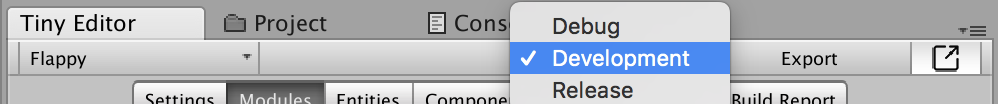

On this toolbar, the first dropdown on the left displays the name of the currently open Tiny project, or "Project" when no project is open. By clicking on it, you open a dropdown menu which lets you create a new Tiny project or module, load existing projects or modules, save the currently open project or module, or close it.

When a project or module is open, you will notice a star ("\*") after its name when its in-memory content differs from its original content when loaded (the project was modified by you, or its file was changed since the last time it was loaded). Saving the project or module by using the Save menu item will update the content on disk, and the star will disappear.

> **Tip!** Don't forget to save your Tiny assets before leaving Unity! You can also save the currently open project or module by hitting `Ctrl+S` (`Command+S` on MacOS) on your keyboard.

The second dropdown lets you select the currently active Tiny build configuration. Three options are available:
* **Debug** Doesn't minify your game code, and uses a debug build of the Tiny runtime. Use this option only when debugging the runtime logic is relevant.
* **Development** is similar to Debug, but it uses a release (optimized, minified) build of the Tiny runtime. This is the fastest build configuration for rapid iteration.
* **Release** When building with this option, your game code will be minified. This operation takes a significant amount of time.

The **Export** button triggers a build for the currently open Tiny project.

> **Tip!** You can also Export by pressing the Unity **Play** button, or hit `Ctrl+P` (`Command+P` on MacOS) on your keyboard.

If the **Preview** toggle is pressed, a successful build will also trigger:
* The creation of a local HTTP server to serve your project's contents
* If no browser session is currently connected to Tiny Unity, your default browser will open a new tab at the project URL
* A "reload" command is sent to refresh any session with the new build (existing browser tabs are thus recycled, and remote sessions are supported)

> **Tip!** You can test your project on any number of devices, as long as they can connect to your computer. Once a remote browser session is established, every build will trigger a reload.

### Settings Tab
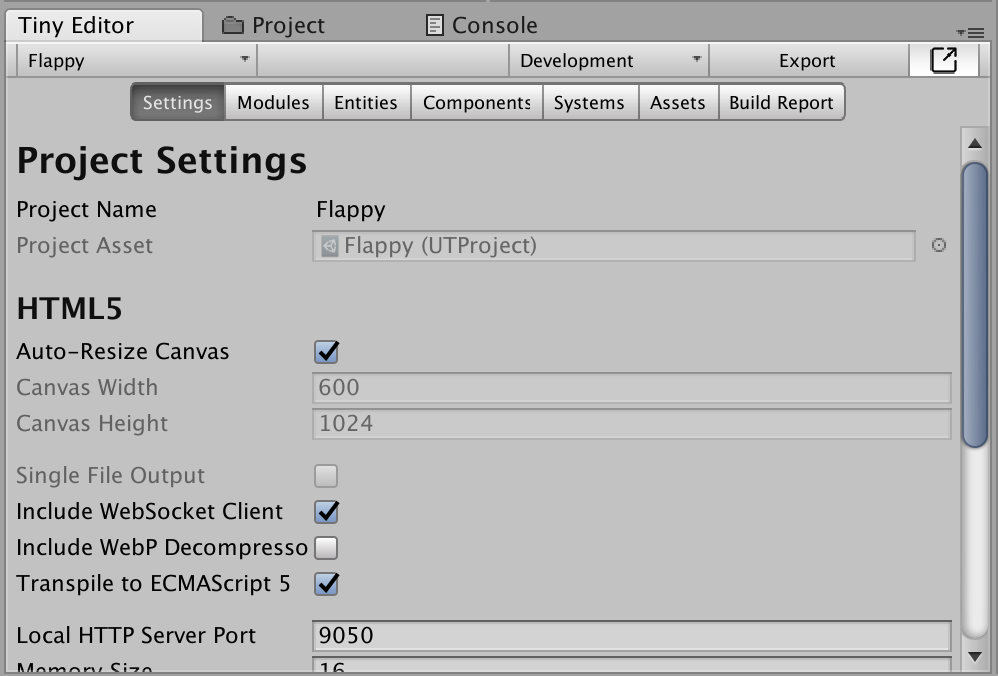

#### HTML5 Settings

**Auto-Resize Canvas**. When checked, the generated HTML canvas element is resized automatically to fit the page body.

**Canvas Width, Height**. The generated HTML canvas element width and height, in pixels. These fields are disabled when *Auto-Resize Canvas* is checked.

**Single File Output**. Release option only. When checked, a single `index.html` file is produced with all the JavaScript (runtime and game) code inlined. Useful when producing playable ads or self-contained demos.

**Include WebSocket Client**. Whether or not to include the code responsible for handling the connection to Tiny Editor.

> **Tip!** While useful when iterating, disable *Include WebSocket Client* when creating a production build.

**Include WebP Decompressor**. [WebP](https://developers.google.com/speed/webp/) is not supported everywhere. If you use WebP images, and target a platform that doesn't support WebP natively, you can check this option to let Tiny Unity take care of WebP decompression (at a cost: your build will include the decompression logic, which is about 30KB compressed).

**Transpile to ECMAScript 5**. JavaScript, an implementation of [ECMAScript](https://en.wikipedia.org/wiki/ECMAScript), is evolving. If your game code contains modern JavaScript, you can check this option to transpile it back to ECMAScript 5, which is supported by most browsers.

**Local HTTP Server Port**. Port of the HTTP server used to preview Tiny Unity content. Defaults to 9050.

**Memory Size**. Total amount of memory (in megabytes) available to the Tiny Unity runtime. Defaults to 16 MB.

#### Assets Settings

**Embedded Assets**. Check this option to embed your game assets (e.g. images) in your game code (e.g. as data URIs) by default. You can override this option on a per-asset basis in the Assets tab.

**Default Texture Format**. Default export format for your texture assets. Options are:
* **Source** The source asset (the file in your Unity project) is copied to your build. Useful when you need full control over a specific asset.
* **PNG** The imported texture is encoded as a PNG image at build time.
* **JPG** The imported texture is encoded as a JPG image at build time. If the texture contains semi-transparent pixels, an alpha mask PNG is also created. JPG compression quality can be configured (between 1 and 100) when this option is selected, and defaults to 75.
* **WebP** The imported asset is encoded as a WebP image at build time. WebP compression quality can be configured (between 1 and 100) when this option is selected, and defaults to 60. WebP usually compresses better than PNG and JPG formats, but is not supported natively by all Web browsers today.

#### Module Settings

In Tiny Unity, a project is a module (named "Main") plus platform and default asset settings. These settings are the "Main" project module settings.

**JavaScript Namespace**. Name of the JavaScript object generated to host all game types, systems, and entity groups. Defaults to "game".

**Description**. Optional game description.

### Modules Tab
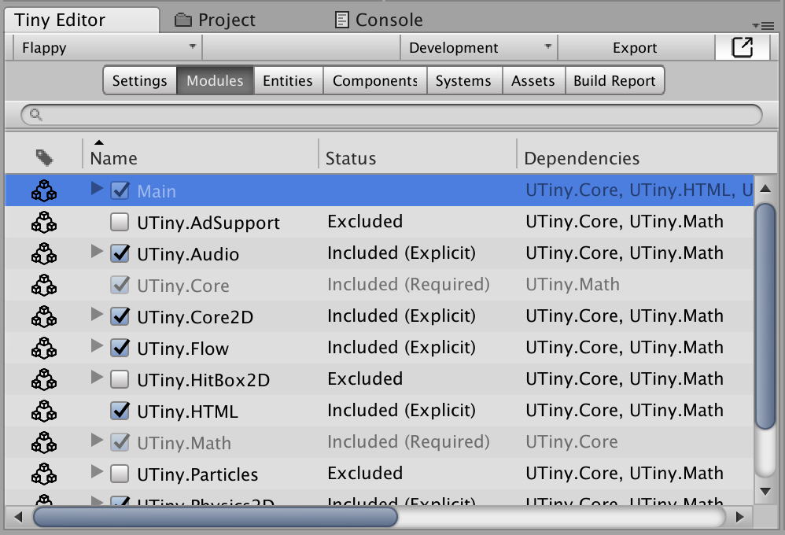

Tiny modules are building blocks available to accelerate game development. They contain data types (Components, Structs and Enums), Entity Groups, and Systems. You can select which modules are included by your game or module in the Modules tab.

Expanding a Module entry (by toggling the arrow in the Name column) gives you quick view to the data types defined by this module.

Some modules are required by the Tiny runtime, and some modules declare dependencies to other modules (the *Dependencies* column). Your main game module declares a dependency to the modules selected in this settings panel. The status column tells you whether or not a module is included in your build:
* *Included (Required)*. This module is required by the Tiny runtime.
* *Included (Explicit)*. Your game explicitly includes this module and all its dependencies.
* *Included (Implicit)*. This module is required by another module included explicitly.
* *Excluded*. This module will not be part of your build.

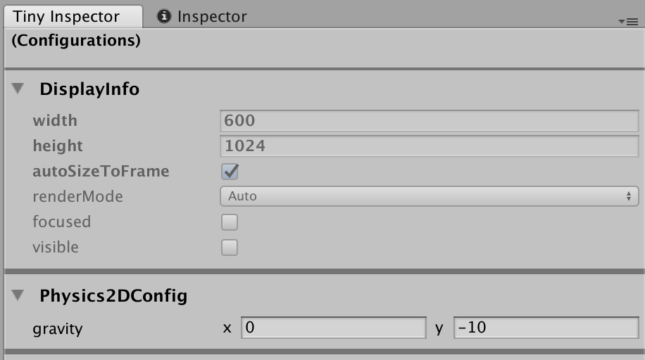

Some native modules can also be configured per project. To edit their configuration components, select any module in the list, and use the Tiny Inspector window to edit the configuration components as shown in the image above.

### Entities Tab
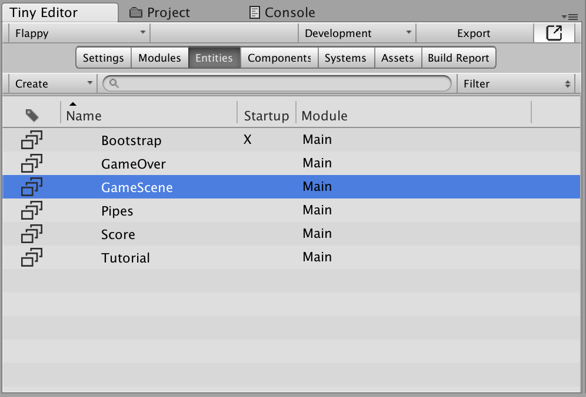

This tab lists the entity groups available in your project. An entity group is like a Scene or a Prefab in Unity, but Entities don't come with GameObject or Transform data.

In this tab, you can create new entity groups (*Create* dropdown, or *Create / EntityGroup* from the context menu), and rename or destroy existing groups using the context menu available when right-clicking in the list. You can also rename a group by clicking again on a selected group.

You can also set a group as the startup group for your project by using *Set as startup* option in the context menu. The startup entity group is loaded automatically when your game loads.

The *Load* options in the context menu will load the selected group(s) in your *Tiny Hierarchy* window. You can also additively load a group by double-clicking on it in the list. *Load / Single* will unload all other groups before loading this group.

Note that you can only have one instance of a group loaded in your hierarchy window at a time.

### Components Tab
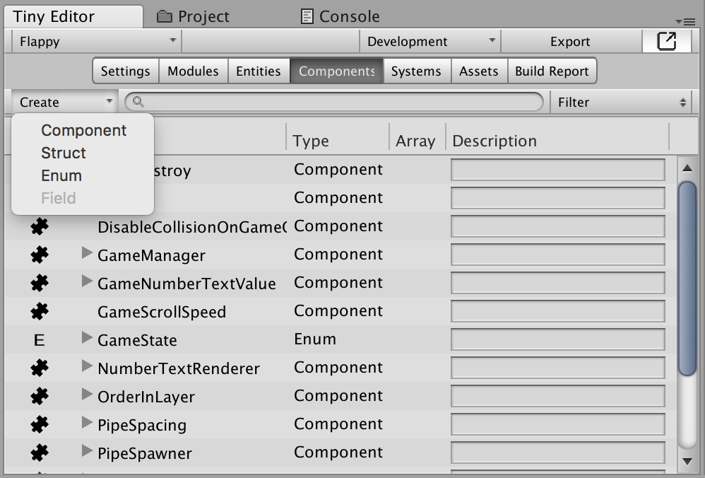

This panel can be used to define Tiny components. Components are like MonoBehaviour classes in Unity, but only contain simple data: primitives (boolean, int, float, string, etc.), structures, and enums. There is no logic in Tiny components!

You can create, rename, or destroy component, struct, enum, or field definitions by using the context menu. Note that fields can only be added when a type (component, struct or enum) is selected.

Any field in a component can become an Array (dynamic list) by checking the Array option.

As more and more types are added to your game, you can find them easily by using the search bar or the Filter dropdown.

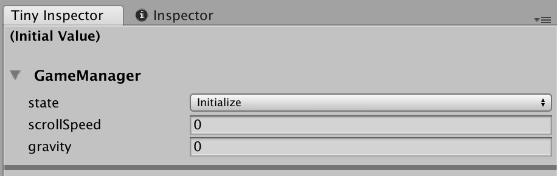

Components have **edit-time only** initial values. This value can be edited by selecting a component in the list, and use the Tiny Inspector window to edit the initial value as shown in the image above.

Note that changing an initial value will also update previously created instances of this component **if and only if** their values were not already overriden locally.

> **Tip!** Overriden values appear in bold in the Tiny Inspector window. You can reset values to their initial state by right-clicking on a component header and select *Reset Initial Values...*.

### Systems Tab
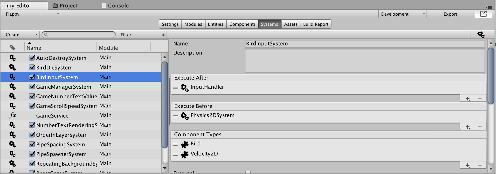

The Systems panel is split in two parts: a list of Systems and Code files on the left, and a System/Code inspector on the right.

Using the list on the left, you can create, rename, and destroy Systems and Code files - either by using the context menu, or by using the *Create* dropdown in the panel toolbar.

#### Systems
Systems can be disabled by checking off the toggle in the *Name* column. Disabling a system still exports it as part of the build - think of it as "disabled at start", and you can enable or disable systems later using the runtime scripting API.

When a System is selected, you can edit its properties on the right panel.

Here's what a system looks like in JavaScript, once generated:
```javascript
NamespaceObject.SystemObject.update = function (scheduler, world) {

	// iterator scope
    world.forEachEntity([ComponentType1, ComponentType2, ...], function (entity, componentType1, componentType2, ...) {

    	// system code
    	// ...

    });
};
```

**Name**. System name that maps to the `SystemObject` identifier in the pseudo-code above. Needs to be a valid qualifier, otherwise changing this field has no effect. Changing the name will also rename the Text asset containing the system JavaScript code, if any.

**Description**. Optional system description.

**Execute After**. The current system needs to run *after* these other systems or fences. The order is not important.

**Execute Before**. The current system needs to run *before* these other systems or fences. The order is not important.

**Component Types**. The current system will run on any entity containing these components. If this list is empty, this system will run once for each entity in the world. The order in this list determines the order of the function parameters passed to the generated system iterator (optional, see *Include Iterator* below).

**External**. When checked, the build system will **assume** that a Code file defines the system `NamespaceObject.SystemObject.update` method (e.g. `game.MySystem.update = function (scheduler, world) { /** your code **/ }`. This option gives you complete control over your system definition, while still taking care of scheduling the systems based on the *Execute After* and *Execute Before* lists.

**Include Iterator**. Non-external only. When checked, the iterator is generated based on *Component Types* list, and you only have to provide the system code in the source Text asset.

**Source**. Non-external only. Source JavaScript text asset. For compatibility reasons, the file has the `.js.txt` extension (`.js` files are supported in Unity as UnityScript assets).

> **Tip!** To get an idea of the final system execution order, you can click on the *gear* icon located at the top right corner of the Systems panel.

#### Code Files
You can also include raw JavaScript files in your projects and modules. Simply use *Create / Code* from the context menu to add a new code file.

### Assets Tab
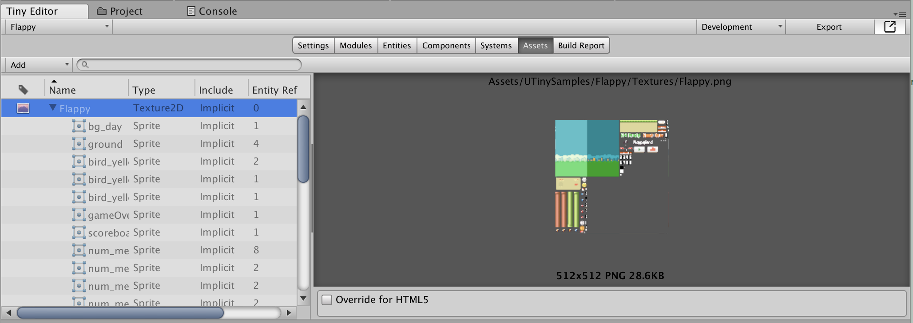

### Build Report Tab
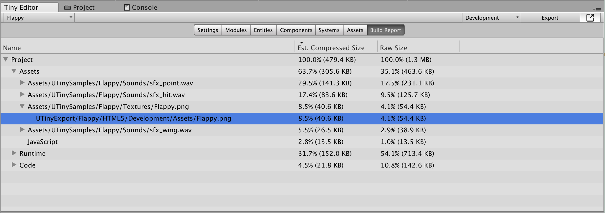

## Tiny Hierarchy Window

## Tiny Inspector Window